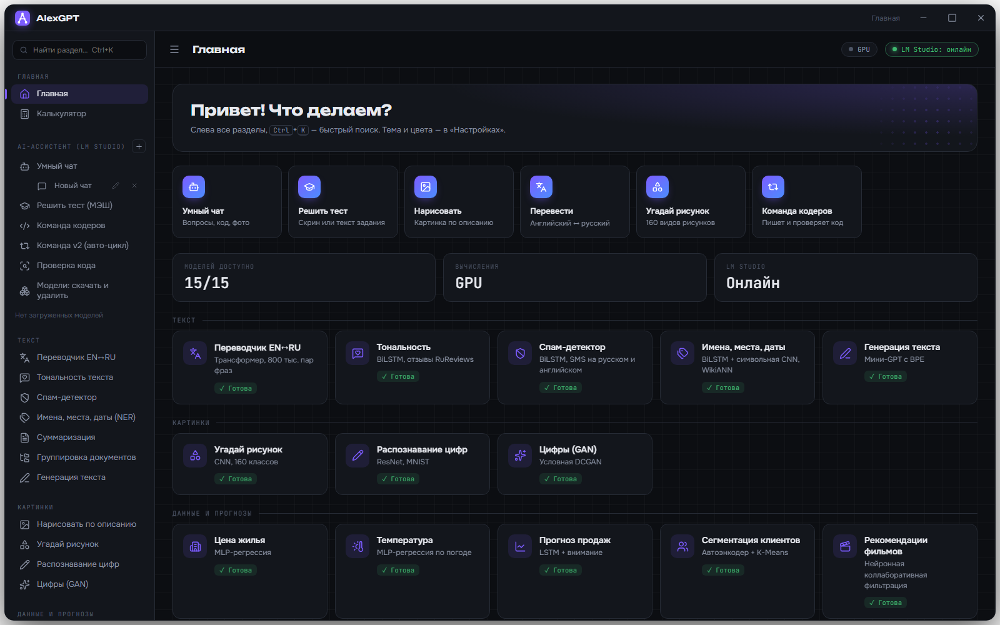
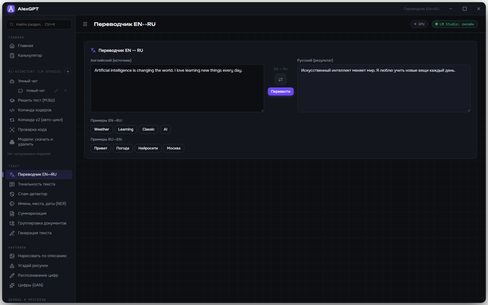
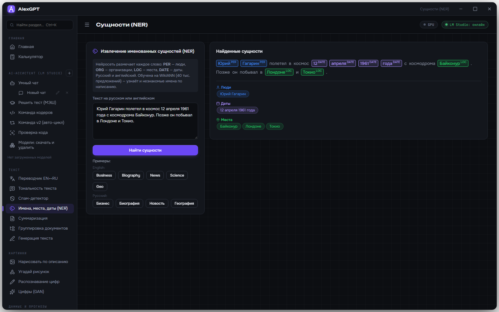
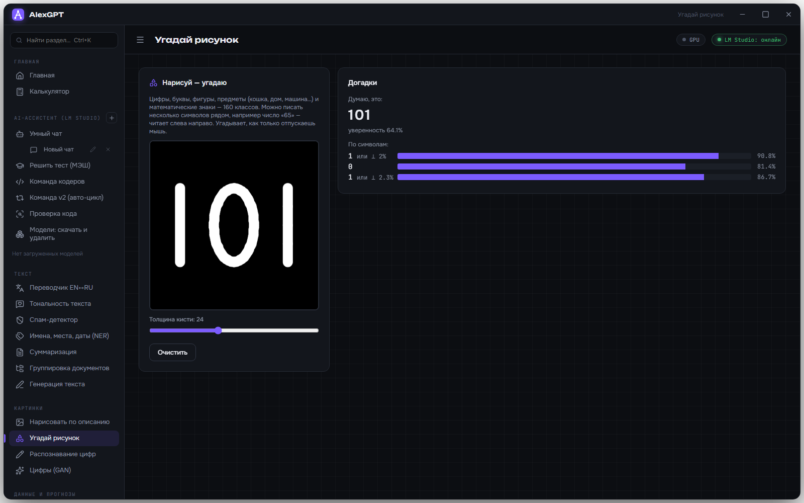
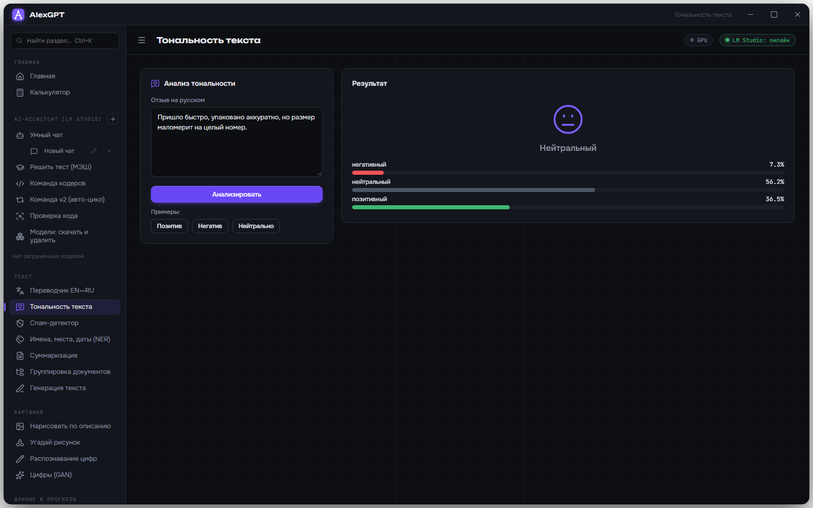
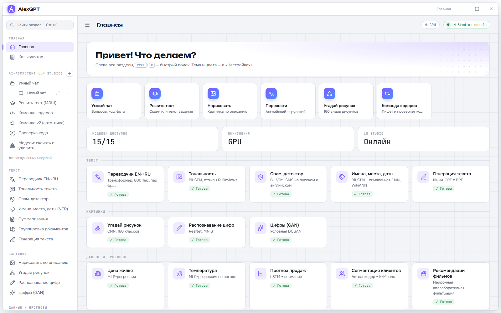
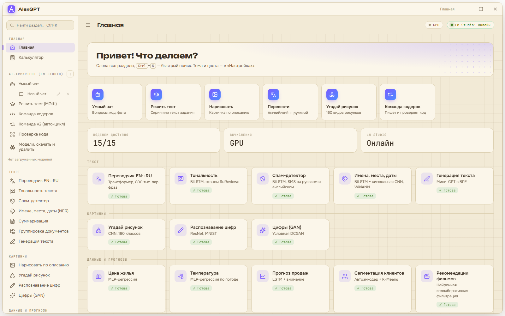

<div align="center">


# AlexGPT · Neural Network Lab

**Local AI workbench for Windows: chat through LM Studio, PyTorch models trained from scratch (translator, NER, sentiment, spam) and SDXL-Turbo drawing.**

[Download for Windows](https://github.com/ALEXalesha/Neural-Network/releases/latest) &nbsp;·&nbsp; [Русская версия этого файла](README.ru.md)

[](https://github.com/ALEXalesha/Neural-Network/actions/workflows/ci.yml)
[](https://github.com/ALEXalesha/Neural-Network/releases/latest)
[](LICENSE)



</div>

> **The interface is in Russian.** Most of the models are Russian-first too: the sentiment model was trained on Russian product reviews, NER and spam work on both languages, the translator goes both ways between English and Russian.

## What this is

A learning project that grew into a desktop application. Two layers:

- `alexgpt/` - the app. Sixteen neural networks of its own, all running on the CPU without internet, plus a chat, a test solver and two "coder teams" that talk to local language models through LM Studio.
- `lab/` - the scripts those sixteen models were trained with, and the experiments that came before them.

Nothing leaves the machine. The own models ship inside the installer; the large language models run in LM Studio on your GPU; the drawing module installs into the app's data folder on request.

## Download

The [releases page](https://github.com/ALEXalesha/Neural-Network/releases/latest) has two builds:

| Build | What it is | Size |
| --- | --- | --- |
| `AlexGPT-<version>-setup.exe` | Installer. No admin rights needed, installs into `%LOCALAPPDATA%\Programs\AlexGPT`, creates shortcuts | 433 MB |
| `AlexGPT-<version>-portable.zip` | Unpack anywhere and run `AlexGPT.exe`. Settings and chats stay in the `data` folder next to it | 540 MB |

No Python needed. A GPU is optional: the own models run on the CPU. Windows 10/11 x64. The binaries are not code-signed, so SmartScreen will ask on first run.

The size is PyTorch: a CPU build of it is most of those 433 MB. The drawing module is not included for the same reason - its CUDA PyTorch and diffusers weigh another 5 GB.

## Own models, no internet

Every number below is measured on data the model did not see during training.

| Section | Model | Quality |
| --- | --- | --- |
| Translator EN↔RU | Transformer, 13.5 M parameters, 800 k Tatoeba sentence pairs | BLEU on unseen sentences: EN→RU 43.5, RU→EN 48.3. Simple sentences come out right, long complex ones get confused; long text is split into sentences |
| Review sentiment | BiLSTM, 45 k RuReviews reviews | 75 % on 15 k test reviews, 3 classes |
| Spam detector | BiLSTM, SMS Spam Collection in Russian and English | 97-98 % on the test set |
| Names, places, dates (NER) | BiLSTM + character CNN, WikiANN ru/en + date templates | F1 0.81 Russian, 0.74 English |
| Guess the drawing | CNN, 160 classes: digits, letters, shapes, objects. Reads several symbols in a row - numbers and words | Separately drawn numbers ("10", "101", "70") and capitals ("ABC") reliably; lowercase is weaker: "a" gets confused with "d" and "2" |
| Digit recognition | ResNet, MNIST | ~99 % |
| Digits (GAN), text generation, forecasts, clustering, recommendations, anomalies, defects | Small teaching models | Teaching data |

| | |
| --- | --- |
|  |  |
| The translator on two unseen sentences | NER marks people, dates and places in running text |
|  |  |
| "101" drawn as three strokes, read as a number | A mixed review lands on "neutral", with the split shown |

### Reading several symbols from one drawing

The drawing network was trained on single symbols, and the whole canvas used to go into it as one 28×28 frame: "65" turned into "W". Since 1.3 the server cuts the drawing into symbols itself (`alexgpt/sketch_segment.py`):

1. It finds connected blobs of ink on a copy no larger than 128×128, which is fast and does not break thin lines. Blobs under 1 % of all ink are noise.
2. Blobs that overlap horizontally by at least 30 % of the narrower one are one symbol, so "=", "i", "÷" and a "5" with a detached bar stay whole. The rest are separate symbols, left to right.
3. Each symbol goes through the same network, and the string is read by rules: if at least half the symbols are digits, look-alikes become digits (| l I → 1, ° O o → 0, S → 5); if at least half are Latin letters, a doubtful symbol becomes the best letter; case is decided by height, because c, o, s, u, v, w, x, z look the same in both cases once size is normalised away.

Cursive written in one stroke cannot be cut this way. That needs a model that reads the whole line, and it would have to be trained from scratch.

## Through LM Studio

Install [LM Studio](https://lmstudio.ai) and turn on its Local Server (port 1234). The app's *Модели: скачать и удалить* section downloads and deletes models itself through the `lms` CLI, with four roles:

| Role | Model | Size | For |
| --- | --- | --- | --- |
| Coder | DeepSeek Coder 6.7B | 3.9 GB | writing and fixing code |
| Analyst | DeepSeek R1 Distill Qwen 7B | 4.7 GB | step-by-step reasoning, problems, tests from text |
| Writer | Qwen2.5 7B Instruct | 4.7 GB | ordinary chat, code review |
| Vision | Qwen2-VL 7B | 7.4 GB | photos and screenshots of assignments |

On top of them: a chat with dialogue memory and images, *Решить тест* (solve a test from text or a screenshot), two coder teams where agents write and review code, and a code check. Any other model can be added by a `https://huggingface.co/<owner>/<repo>@<quant>` link. For 8 GB of video memory, models up to 7-8B in Q4_K_M fit.

Two things learned the hard way are built in. The analyst (R1) gets its instructions inside the user message instead of a system prompt, at temperature 0.6, as DeepSeek recommends; with a system prompt at 0.1 it answered "Lyon" to "capital of France?" in a test. And LM Studio listens on IPv4 only, while Windows tries `localhost` over IPv6 first and waits about 2 seconds for that to fail - on every request. The app always calls `127.0.0.1`, even if the config says `localhost`.

## Drawing from a description

SDXL-Turbo, 512×512. The *Установить модуль рисования* button downloads [uv](https://github.com/astral-sh/uv), installs a separate Python 3.12 with PyTorch (CUDA if there is an NVIDIA card, CPU otherwise), diffusers and the model (6.5 GB, shared Hugging Face cache - not downloaded twice). A separate worker process keeps the model in memory between pictures.

On a 12 GB card a picture takes 1-3 seconds. On 8 GB the full pipeline needs about 9.2 GB, the driver spills into shared memory and a picture takes 33 seconds. The worker therefore keeps the text encoders on the CPU when there is less than 11 GB of video memory, which brings it down to about 6 seconds.

## Themes

Five themes (dark, midnight, graphite, light, sepia) and six accent colours in *Настройки*. Everything works offline: the [Lucide](https://lucide.dev) icons (ISC) and the Onest, Unbounded and JetBrains Mono fonts (OFL) ship in `alexgpt/static` with their licences.

| | |
| --- | --- |
|  |  |
| Light | Sepia |

## Running from source

```bash
git lfs install
git clone https://github.com/ALEXalesha/Neural-Network.git
cd Neural-Network
python -m venv .venv
.venv\Scripts\pip install -r requirements-dev.txt
.venv\Scripts\python alexgpt\main.py
```

The model weights in `models/` (207 MB) are stored with Git LFS. GitHub's free LFS bandwidth is 1 GB a month for the whole repository, so if a clone gives you small text files instead of `.pth` weights, the quota has run out; the same weights are inside the portable build on the releases page.

Put your own `lm_config.json` in the data folder so updates do not overwrite it: `.appdata/` when running from source, `%LOCALAPPDATA%\AlexGPT` for the installed app, `data/` for portable.

## Tests

```bash
.venv\Scripts\python -m pytest tests
```

271 tests, about 40 seconds. Most of them check invariants over hundreds of random inputs with hypothesis rather than hand-picked examples: the server never answers 500, JSON is always valid, probabilities always add up to 100 %, deleting a model never reaches outside the LM Studio folder, parsing a model's answer never breaks on any text. `HYPOTHESIS_PROFILE=thorough` raises it to 1000 examples per test.

Two files do something different:

- `test_model_quality.py` checks that the trained models answer obvious examples correctly. That is how a broken translator is caught: the previous one had degenerated into producing fluent Russian that ignored the source sentence, and no unit test on the code would have noticed.
- `test_sketch_segment.py` checks the symbol cutter (every blob of ink ends up in exactly one symbol, symbols go left to right, a thin diagonal does not fall apart, noise never becomes a symbol) and then, on the real model, that drawn "10", "11", "70", "101", "ABC" and "bc" are read exactly so. A mutation run over that module caught 29 planted bugs out of 29.

## Building

```bash
powershell -ExecutionPolicy Bypass -File packaging\build.ps1
```

The script creates `packaging/.buildvenv` with CPU PyTorch, builds the PyInstaller version and puts the portable zip and the installer into `packaging/dist/` (needs NSIS: `winget install NSIS.NSIS`).

Inside the frozen build every child process is `AlexGPT.exe` with a key (`--server`, `--run`, `--pyfile`), never `python`. The drawing module's Python 3.12 is started with `-P`: without it the script's own folder goes onto `sys.path`, picks up the app's Python 3.13 libraries and fails with "python313.dll conflicts". Running from source never shows this, so it has to be checked in the installed exe.

## Training

Scripts run from `lab/` (`cd lab`), dependencies in `lab/requirements.txt`. Datasets download themselves from Hugging Face; results (`*.pth`) stay local until copied into `models/`.

| Script | Model | Time on an RTX card |
| --- | --- | --- |
| `train_translator_bpe.py` | Translator EN↔RU (needs `tatoeba_*.tsv.bz2` from tatoeba.org) | ~2 h per direction |
| `train_sentiment.py` | Sentiment, RuReviews | 2 min |
| `train_spam.py` | Spam, SMS Spam Collection + Russian translation | 1 min |
| `train_ner.py` | NER, WikiANN + date templates | 25 min |
| other `train_*.py` | Anomalies, defects, clustering, recommendations, temperature | minutes |

Why the translator was retrained: the previous version had collapsed. The decoder learned to produce plausible Russian sentences and stopped looking at the input. The current one is a pre-LN transformer with learning-rate warm-up, padding masks and early stopping. `python eval_translator.py` compares both directions by BLEU and chrF on 3000 held-out pairs.

## Project layout

| Path | What |
| --- | --- |
| `alexgpt/main.py` | Entry point: window, server and child processes |
| `alexgpt/gui.py` | PyQt6 + QtWebEngine window |
| `alexgpt/app_server.py` | Flask server: every model, the API, LM Studio management |
| `alexgpt/sketch_segment.py` | Guess the drawing: cutting into symbols and reading a number or a word |
| `alexgpt/coder_team.py`, `coder_team_v2.py` | LLM agent teams that write and review code |
| `alexgpt/templates/app.html` | The whole interface |
| `models/` | Weights and tokenizers (Git LFS) |
| `lab/` | Training |
| `tests/` | pytest + hypothesis |
| `packaging/` | PyInstaller spec, NSIS script, icon, `build.ps1` |
| `tools/make_screenshots.py` | Redraws every picture in this README from the running app |

## Licences

The code is MIT, see [LICENSE](LICENSE). The weights in `models/` were trained on public datasets that keep their own terms: Tatoeba (CC BY 2.0 FR), RuReviews, WikiANN, SMS Spam Collection, MNIST. If you redistribute the weights, those terms travel with them.
